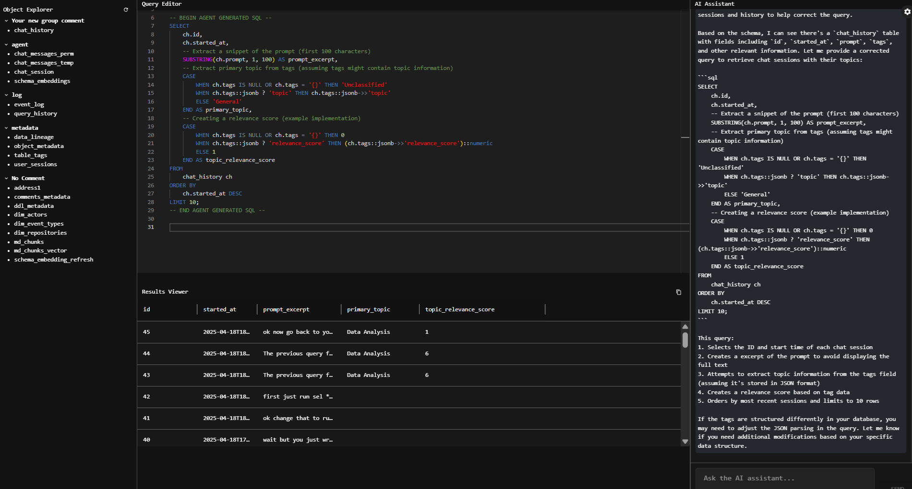

# AI Warehouse: AI-Powered DBA Web UI

This project is a modern, intuitive web-based UI for database administration and SQL analytics, inspired by Amazon Redshift Query Editor v2, with deep AI chat assistant (LLM) integration.

## What this system does

- Provides a dark-mode, resizable, space-efficient SQL query editor with syntax highlighting and multi-query support.
- Features a database object explorer that groups tables by their comment, never showing schema names.
- Allows users to run multiple queries at once and view results in a dense, copy-friendly results grid.
- Supports an AI chat assistant that can see all query editor content, generate and optimize SQL, and interact with query results.
- Saves all queries to a `query_history` table and all chats to a `chat_history` table for full auditability.
- All panes (object explorer, query editor, results, chat) are slidable and resizable.
- Text is extremely small to maximize screen real estate.
- Built with React + TypeScript (frontend) and Node.js + Express (backend), with Postgres as the database.
- Uses environment variables from `.env` for all API keys and database URLs (see `.env` for details).

## Setup
1. Copy your required API keys and `POSTGRES_URL` into a `.env` file at the project root.
2. Run `npm install` in both `/server` and `/client` directories.
3. Start the backend server from `/server` with `npm run dev`.
4. Start the frontend from `/client` with `npm start`.

## Features
- Dark mode by default
- Slidable/resizable panes
- Multi-query SQL editor
- Results easily copyable to notepad
- Extremely small text
- Query and chat history persistence
- AI assistant always sees full editor content
- Object explorer groups tables by comment
- **System prompt is now user-editable**: The system prompt can be updated at runtime, allowing flexible agent behavior and experimentation.

## Recent Features Added (2025-04)
- **AI Chat Assistant**: Integrated Anthropic Sonnet 3.7 LLM via `/api/ai-chat` endpoint. Streams responses in a dedicated right-side panel.
- **Streaming Chat UI**: AI chat panel displays streaming responses, supports multi-line input, and always has access to the SQL editor.
- **Results Copy Button**: One-click copy of results as TSV to clipboard, with Snackbar notification.
- **Dark Mode & Tiny Text**: Full dark mode, extremely small text for all UI elements.
- **Resizable Panes**: All panes (object explorer, editor, results, chat) are slidable/resizable.
- **Object Explorer**: Groups tables by comment, supports refresh, and collapsible groups.
- **Multi-query Support**: Query editor supports multiple queries per submission.
- **History Persistence**: Every executed query and chat is saved to the database for auditing.
- **Security**: API keys secured in `.env`, backend never exposes secrets to frontend, user input validated.
- **Agent SQL Insertion Markup** (2025-04-18): All agent-generated SQL is now inserted into the editor with two blank lines above and below, and clear header/footer comments (`-- BEGIN AGENT GENERATED SQL --`, `-- END AGENT GENERATED SQL --`). This ensures visually distinct, clearly marked SQL blocks regardless of how the agent returns code.

## Current Status (2025-04-18)

- The AI assistant now answers **only using schema embeddings**; all documentation and md_chunks vector store context have been removed from the prompt, ensuring the agent relies strictly on the schema.
- The system prompt is **user-editable and flexible**; it is no longer rigidly locked to a single style, allowing users to experiment with different agent behaviors.
- Frontend vetting logic flags hallucinated table names and provides user controls for regenerating or approving responses.
- The chat panel now auto-scrolls to the latest message, improving UX.
- All major blockers around context leakage and hallucinated SQL have been mitigated. Backend guardrails are recommended for 100% reliability on schema enumeration/count queries.
- All code and configuration changes are up to date with the current state.

### Next Steps
- (Optional) Add backend interception for schema enumeration/count queries for guaranteed accuracy.
- Continue polish, code cleanup, and user experience improvements as needed.

## Project Structure
```
/ai-warehouse/
  /client/      # React frontend
  /server/      # Node.js backend
  .env          # Environment variables (never committed)
  README.md
```

## License
Proprietary, (c) 2025 cklose2000 and contributors.
